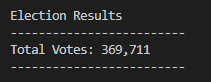
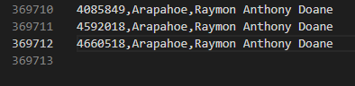
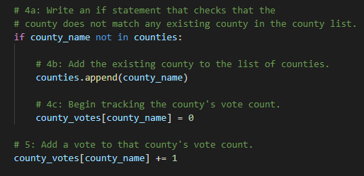
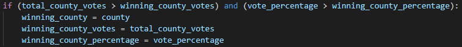

# Election Analysis
This is an analysis of election results followed by recommendations for the election commission for upcoming elections.

## Overview of Election Audit: Explain the purpose of this election audit analysis.
This election audit analysis was requested by the election commission, originally to review a database of all votes and review which candidate had the most votes. It was later expanded to include voter turnouts by county as well. To do this I used a python script to read the contents of a voter results csv file, extract and analyze the relevant information inside, and write the results to an output file. With the information provided we can assess the number of total votes, votes by county, and candidate vote percentages and totals, all of which are detailed below. The raw election results file is kept in the _Resources_ directory, while the output or final analysis is written to the _analysis_ directory. 

## Election-Audit Results: 

* How many votes were cast in this congressional election?

    There were **369,711 Votes** in this election. This was verified through counting every vote (upper image) and can be seen as the final line in the raw data as well (lower image, the top line of the date is a header).
    
    
    
    
    
   
* Breakdown of total votes by county

   To get the total votes of each county I cycled through every vote and added the vote to a county list. This code is dynamic and adds county names on the fly; this will allow it to be done with any county name and any number of counties. This brief code snippet shows the process:
   
   
   
   After acquiring a list of total votes by county, the winner was found by adding the name, vote count, and vote percentage count to a 'winner' variable that was overridden by anything with larger totals. The code snippet below illustrates the process:
   
   
   
   Below are the results of total county votes:

  |  County | # of Total Votes | % of Total Votes  |
  | ------------- | ------------- | ------------- |
  | Jefferson  | 38,855  | 10.5%  |
  | Denver  | 306,055  | 82.8%  |
  | Arapahoe  | 24,801  | 6.7%  |

* Which county had the largest number of votes?

    **Denver County** had by far the largest number of votes at **306,005** with a whopping **82.8%** of the total vote, roughly a factor of ten greater than both Jefferson and Arapahoe counties.

* Breakdown of total votes by candidate

    The process of counting the total votes by candidate was done in precisely the same way as the counties. Below are the results:

  |  County | # of Total Votes | % of Total Votes  |
  | ------------- | ------------- | ------------- |
  | Charles Casper Stockham  | 85,213  | 23.0%   |
  | Diana DeGette  | 272,892  | 73.8%  |
  | Raymon Anthony Doane  | 11,606  |3.1%  |

* Which candidate won the election, what was their vote count, and what was their percentage of the total votes?
    
    According to my results **the winner of the election was Diana DeGette**, with a landslide victory of **73.8% of all votes** and total vote count of **272,892**.

# Election-Audit Summary: 
In summary, this code can be used for any sort of upcoming election in its current state as long as the format of the input data remains the same. As was described above, the candidate and county names can be read in dynamically with no limit on the number of each. However, there are a couple things that could be done to improve the code to provide more information in the future. 

For starters, we could count which votes for each candidate came from which counties. This information doesn't influence the results of the election in any way but it would provide extra data and insight into the demographics of the candidate's voters. This change would be possible with the amount of information we have available here, but if there was any additional data that the commission needed, the program could be modified to show that as well. A couple examples would be anonymous voter data, such as age, for more demographic insights. We could also add in the way the vote was cast (machine vs by hand vs machine read card) to see if there was any influence or correlation with voting methods and results. Finally, adding in total county population data would allow us to learn about voter turnout and participation in each county.

I would also recommend that records of this data not only be kept for posterity but also for future analysis. With a database of past election results, we can map changes over time for trends and other insights.
